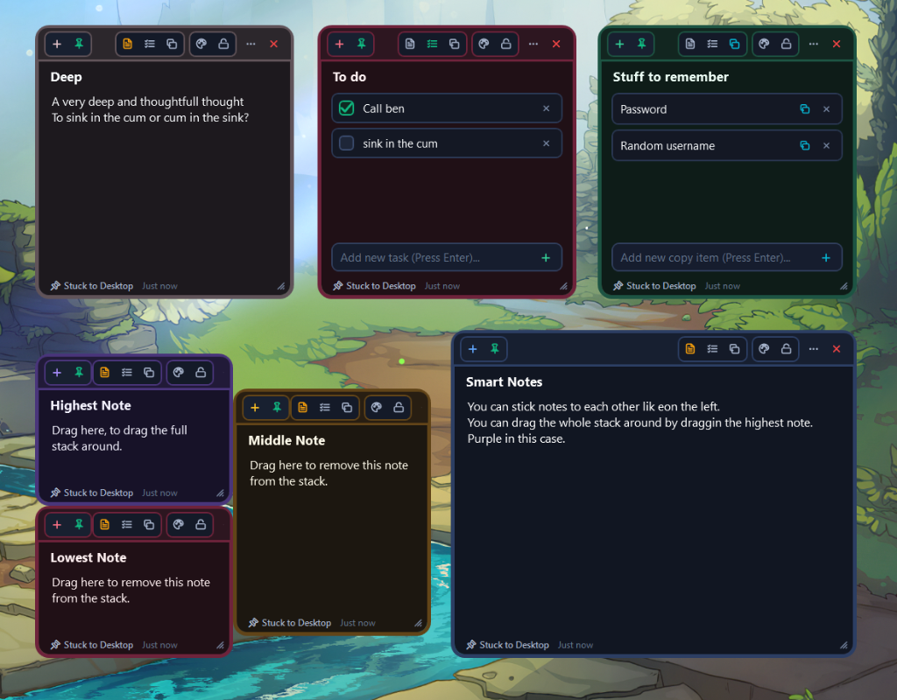

# 📝 SmartNotes

**Sleek Desktop Sticky Notes for Windows with Win32 Permanent Layer Sticking & Magnetic Stack Docking**

[-06B6D4?style=for-the-badge&logo=windows&logoColor=white)](https://github.com/OlfJD/SmartNotes/releases/latest/download/SmartNotes-v1.1.3-win-x64.zip)

### 📥 [👉 Click Here to Download SmartNotes for Windows (.zip)](https://github.com/OlfJD/SmartNotes/releases/latest/download/SmartNotes-v1.1.3-win-x64.zip)

*(No installation required — just extract and run!)*

 

---

## ⚡ Quick Start for Users

1. **[Download the Latest Release (.zip)](https://github.com/OlfJD/SmartNotes/releases/latest/download/SmartNotes-v1.1.3-win-x64.zip)**.
2. **Extract** the ZIP folder anywhere on your PC (e.g. `Desktop` or `Documents`).
3. Double-click **`SmartNotes.exe`** (or `Launch SmartNotes.bat`) to start!

---

## ✨ Features

- **🧲 Magnetic Stack Leader Dragging & Docking (v1.1.3)**:
  - Drag notes next to one another to magnetically **snap and stick them together** into connected stacks and clusters.
  - **Highest Note (Stack Leader)**: Drag the highest note of any docked cluster to move the entire stack around together seamlessly.
  - **Effortless Peeling & Separation**: Drag any middle or lower note to instantly peel it away from the stack independently (no keyboard shortcuts needed!).

- **🎨 Professional 2D Drawing-App Color Picker (v1.1.3)**:
  - Integrated 2D Saturation / Value gradient canvas with interactive crosshair target thumb (identical to Photoshop, Figma, and Procreate).
  - Smooth 0–360° Hue spectrum slider, real-time live swatch preview, #Hex code input, and 8 centered obsidian neon presets.

- **🔄 Automatic Update System (v1.1.3)**:
  - Automatically scans GitHub for new releases whenever SmartNotes starts up.
  - Seamless 1-click in-place update download, extraction, and auto-restart.
  - Manual update checks available in the 3-dot note menu (`⋯`) and system tray.

- **📌 Permanent Desktop Layer Sticking (Below All Applications)**:
  - Notes live on the desktop wallpaper level (`HWND_BOTTOM`).
  - When opening Chrome, games, IDEs, or full-screen apps, SmartNotes stays quietly beneath them without popping over or stealing focus.
  - Per-note Pin Mode toggle: Switch between **📌 Desktop Stuck (Behind Apps)** and **📌 Always on Top (Floating)**.

- **3 Specialized Note Modes**:
  - **📝 Plain Text / Markdown**: Multiline note taking with markdown export and live auto-save indicators.
  - **☑️ Todo Checklist**: Interactive task checkboxes with strike-through and progress tracking.
  - **📋 Copy Compartments**: Quick-copy snippet rows with dedicated 1-click `[ 📋 ]` copy buttons on every line with green checkmark confirmation.

- **Exact Coordinate & Dimension Persistence**:
  - Automatically remembers every note's exact `(X, Y)` position, `Width`, `Height`, font size, opacity, and color.
  - Changes save continuously in the background to `%APPDATA%\SmartNotes\notes.json`.

- **5px Crisp Vector Borders & Zero Black Pixel Artifacts**:
  - Premium Obsidian dark aesthetics with thick 5px vector borders and seamless antialiased rounded corners.

- **Global System Shortcuts**:
  - `Win + Alt + N` : Spawn a new sticky note anywhere on your desktop.
  - `Win + Alt + D` : Toggle Show / Hide all sticky notes on desktop.
